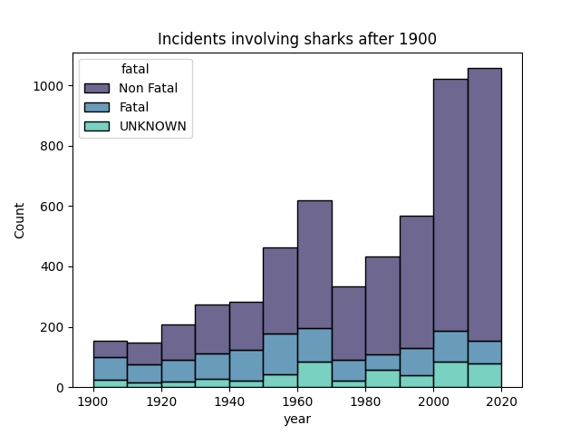
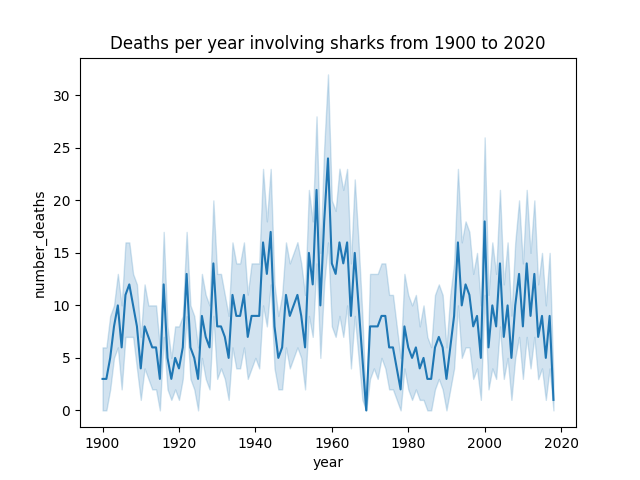
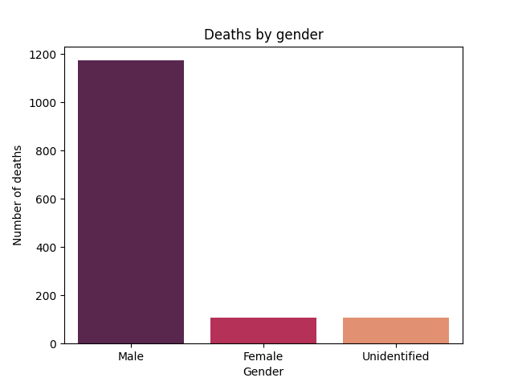
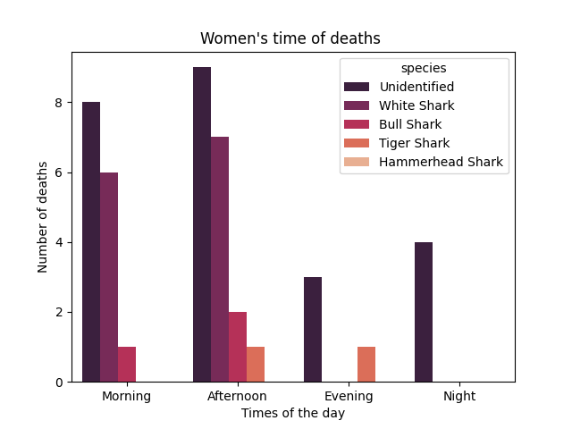
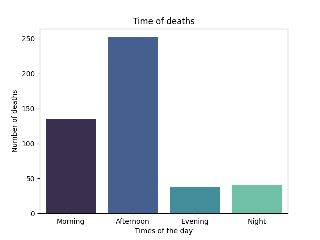
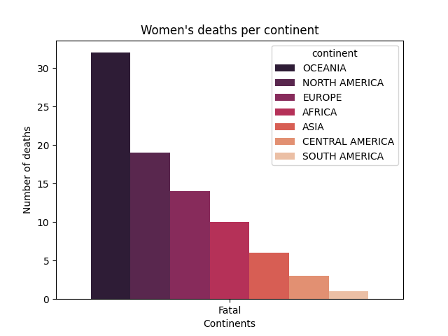

# Jaws-EDA

## Introduction
This repo was created for an exploratory analysis of the global shark attack database, available in the link bellow. https://www.kaggle.com/datasets/teajay/global-shark-attacks

The objective of this analysis is to explores some cleaning and visualization tecniques in order to answer some questions regarding the behavior of sharks.

## Description
This  analysis will explore a few questions such as: 
- "Do sharks demonstrate special hate towards women?"
- "When and where do most deaths occur?"
- "Does any particular species attack more women?"

Since the sorce data is very inconsistent, many different tecniques had to be used in order to standardize some of the informartion needed for the analysis:
- Removal of duplicates
- Droping collumn and row not useful to our goal
- Fill NaNs with iterable/useful information
- Application of RegEx
- Stardardization of informations and titles applying dictionaries

Two extra columns were created in order to group information in clusters more useful to the visualizations required.

## Tecnologies
For this project five different libraries were used: 
- pandas
- matplotlib 
- seaborn 
- os module
- re for RegEx

## Conclusions
From the questions presented the conclusions are demonstrated through the following charts:

Sharks attacks deaths more often occur to men rather than women. Persisting on investigating deaths of women, the data shows that it is difficult to identify the attacking species, but White sharks and Tiger Sharks are the most active/or easy to indentify. Their prefered time time to attack  is in the afternoon.

## Launch
1. Git clone this repo
2. Open your command module and run the file `main.py`